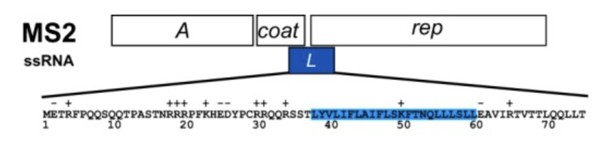

# DNA Sequence Optimizer

This tool helps optimize overlapping gene sequences, inspired by a project in "How to Grow Almost Anything" where we needed to update a protein sequence using AI. However, the sequence overlaps with another sequence.



## Problem
When two genes overlap in DNA, changing one sequence can break the other. This tool updates codons to keep a base sequence the same and minimize errors with the new sequence. 

## Example Usage

For the htgaa final project I was looking to bind the lysis protein to another protein (as opposed to Dnaj): https://spotless-bongo-449.notion.site/Group-Project-1af905f53b4b8071864cc252b8b00a7e?pvs=4
This meant updating the N terminus of the lysis protein. I used pepMLM https://colab.research.google.com/drive/1u0i-LBog_lvQ5YRKs7QLKh_RtI-tV8qM?usp=sharing#scrollTo=VtfbXYndhyle to generate binders which can be found in test.csv. I then ran all the binders through the protein optimizer and selected the peptide with the lease amount of errors.

# Supported Features
- similar switches: If it cannot find another way to code the amino acid to keep the sequences the same in protein space, as a fallback, the algorithm will try other amino acids of the same "type" for instance if in the new sequence you have an Alanine and even with GAT, GCC, GCA, GCG it cannot find a way to align with the original sequence, it will try all the other hydrophobic amino acids

## Usage

Run the program interactively:
```bash
python main.py
```

You'll be prompted for:
- DNA sequence: The original DNA sequence
- Gene A start position: Where the first gene starts
- Gene A end position: Where the first gene ends
- Gene B start position: Where the second gene starts  
- Gene B end position: Where the second gene ends
- New Gene B sequence: The new sequence you want for Gene B

### Example

From our test case:

Original sequence A:
- DNA: GATGGAAACCCGATTCCCTCAGCAATCGCAGCAAACTCCGGCATCTACTAA
- protein: DGNPIPSAIAANSGIY

New sequence B:
- DNA: ATGGCGTGGACCAGCATTTATGAACTGGATGCGCTGAACAACTGCCGTAAAGGTCAGCGCCAGGCCGTGGGCAGCAGCCGCCGCTGCCGCCGCCAGCAGCGTAGCAGCACCCTGTACGTGCTGATTTTTCTGGCGATTTTTCGAGCAAATTTACCAACCAGCTGCTGCTGAGCCTGCTGGAAGCGGTGATTCGCACCGTGACCACCCTGCAGCAGCTGCTGACCTGA
- protein: MAWTSIYELDALNNCRKGQRQAVGSSRRCRRQQRSSTLYVLIFLAIFLSKFTNQLLLSLLEAVIRTVTTLQQLLT

The sequences are offset by 1

Result:
- DNA: GATGGCAACCCGATCCCCTCAGCAATTGCAGCAAACTCCGGCATCTACTAAGGGTCAGCGCCAGGCCGTGGGCAGCAGCCGCCGCTGCCGCCGCCAGCAGCGTAGCAGCACCCTGTACGTGCTGATTTTTCTGGCGATTTTTCTGAGCAAATTTACCAACCAGCTGCTGCTGAGCCTGCTGGAAGCGGTGATTCGCACCGTGACCACCCTGCAGCAGCTGCTGACCTGA
- Protein: DGNPIPSAIAANSGIY*GSAPGRGQQPPLPPPAA*QHPVRADFSGDFSEQIYQPAAAEPAGSGDSHRDHPAAAADL
- Protein offset by 1: MATRSPQQLQQTPASTKGQRQAVGSSRRCRRQQRSSTLYVLIFLAIFLSKFTNQLLLSLLEAVIRTVTTLQQLLT

As you can see the original protein A's protein sequence has not changed but the codons have in order to minimize the errors in the new sequence:
- Sequence A protein:           DGNPIPSAIAANSGIY
- Sequence A protein in result: DGNPIPSAIAANSGIY

- Sequence A DNA:           GATGGAAACCCGATTCCCTCAGCAATCGCAGCAAACTCCGGCATCTACTAA
- Sequence A DNA in result: GATGGCAACCCGATCCCCTCAGCAATTGCAGCAAACTCCGGCATCTACTAA